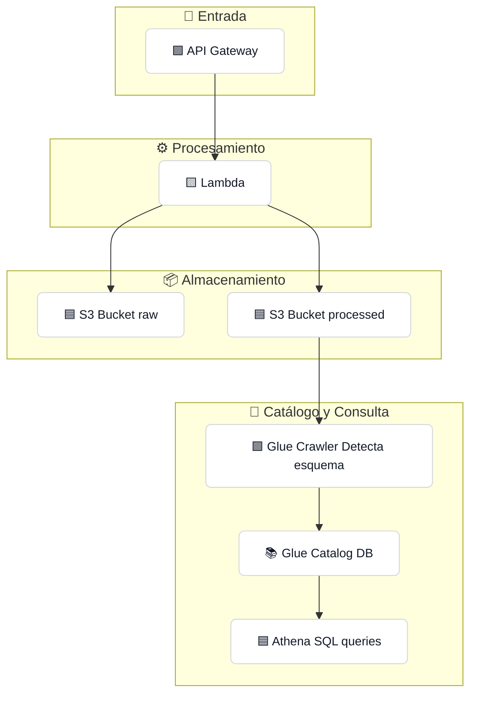

# 🚀 TERRAFORM-SERVERLESS-ETL

Este repositorio contiene una arquitectura serverless, modular y escalable para proyectos de ETL/ELT sobre AWS. Fue diseñada para ser fácilmente reutilizable en distintos proyectos de procesamiento de datos.

---

## 📦 Componentes principales

- **AWS Lambda**: Extrae datos desde una fuente externa (API, etc.)
- **API Gateway**: Dispara la Lambda vía POST
- **S3 (Data Lake)**:
  - `raw/`: datos originales
  - `processed/`: datos transformados o listos para consulta
- **Glue Crawler**: Analiza los archivos en S3
- **Glue Catalog Database**: Registra el esquema de las tablas
- **Athena**: Permite consultas SQL sobre los datos
- **Secrets Manager**: Almacena tokens o credenciales sensibles
---

## 🧱 Estructura del repositorio

```
terraform-serverless-etl/
├── main.tf                  # Orquesta todos los módulos
├── variables.tf             # Variables globales
├── outputs.tf               # Valores de salida
├── locals.tf                # Tags comunes y valores derivados
├── provider.tf              # Configuración AWS
├── .gitignore
├── modules/
│   ├── lambda/
│   ├── apigateway/
│   ├── storage/
│   ├── crawler/
│   └── data_catalog/
```

---

## 🌐 Arquitectura general



---

## ⚙️ Despliegue

```bash
terraform init
terraform apply
```

> ⚠️ Asegurate de configurar previamente el Secret en AWS Secrets Manager con tu token de acceso a la API.

